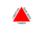
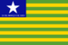

# Empresas de Tecnologia da Informação

Esse projeto tem o objetivo de listar empresas da área de tecnologia da informação do Brasil classificando-as pelas cidades onde estão presentes.

Contribuições para o projeto são bem-vindas e necessárias para que o catálogo de empresas fique completo.

## Empresas por estado

|                 BANDEIRA                     |                ESTADO                          |
| -------------------------------------------- | -----------------------------------------------|
|  | [Acre](/acre.md)                               |
|  | [Alagoas](/alagoas.md)                         |
|  | [Amapá](/amapa.md)                             |
|  | [Amazonas](/amazonas.md)                       |
|  | [Bahia](/bahia.md)                             |
|  | [Ceará](/ceara.md)                             |
|  | [Distrito Federal](/distrito-federal.md)       |
|  | [Espírito Santo](/espirito-santo.md)           |
|  | [Goiás](/goias.md)                             |
|  | [Maranhão](/maranhao.md)                       |
|  | [Mato Grosso](/mato-grosso.md)                 |
|  | [Mato Grosso do Sul](/mato-grosso-do-sul.md)   |
|  | [Minas Gerais](/minas-gerais.md)               |
|  | [Pará](/para.md)                               |
|  | [Paraíba](/paraiba.md)                         |
|  | [Paraná](/parana.md)                           |
|  | [Pernambuco](/pernambuco.md)                   |
|  | [Piauí](/piaui.md)                             |
|  | [Rio de Janeiro](/rio-de-janeiro.md)           |
|  | [Rio Grande do Norte](/rio-grande-do-norte.md) |
|  | [Rio Grande do Sul](/rio-grande-do-sul.md)     |
|  | [Rondônia](/rondonia.md)                       |
|  | [Roraima](/roraima.md)                         |
|  | [Santa Catarina](/santa-catarina.md)           |
|  | [São Paulo](/sao-paulo.md)                     |
|  | [Sergipe](/sergipe.md)                         |
|  | [Tocantins](/tocantins.md)                     |
|  | [Internacional (remoto)](/internacional-remoto.md) |